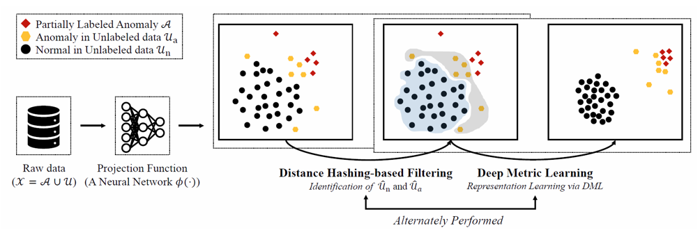

# PUMAD 

PU Learning for Anomaly Detection 

Postech DI Lab with Samsung Network Division 2021.05.10 ~ 2022. 04. 29



# Requirements

- python 3.8
- see requirements.txt

```
conda create –n env_name python=3.8
conda activate env_name
pip install --upgrade pip
pip install -r requirements.txt
```

# Datasets 

```
X: input data [ndarray] *shape (data, # of features, window length) 
y: input labels [ndarray] *shape : (data) 
```

# Train & Evaluation 

Measure the AUC at each epochs 

```
python train.py --device <gpu number> --dataset <name of .npy file> --data_path <location of files> --window <length of sliding window> 
```

The detailed descriptions about the parameters are as following:
Note : There is 

| Parameter name | Description of parameter |
| --- | --- |
| device | device that the code works on, 'cpu' or 'cuda:\#' | 
| data_name | file name of input .npy |
| data_path | train data and test data path |
| window | length of sliding window, default 10 |
| positive_ratio | labeled anomalies ratio, default 1 |
| n_bits | # of bits of each hash tables, default 5|
| n_hash_tables | # of hash tables, default 5|
| model | embedding model, default "wavenet" |
| n_epochs | epoch size during training, default 10|
| n_batch | batch size, default 512 |
| lr | learning rate, default 1e-4 |
| hidden_size | hyper parameter of hidden layers channel, default 128 |
| margin | margin of triplet loss, default 2 |

## Evaluation 

precision, recall, F1-score


### Saliency map
```sh
python test.py save/[CHECKPOINT].pth
python heatmap.py --savedir save --dataset unsw-nb15 --window_size 10 --plotting
```
Run `test.py` first, then run `heatmap.py`. \
The parameters of the `test.py` are same as `train.py`, except the checkpoint path.\
The parameters of the `heatmap.py` are:\
`heatmap.py [-h] [--save_dir SAVE_DIR] [--dataset DATASET] [--window_size WINDOW_SIZE] [--_class {,_normal,_anomaly}] [--plotting]` \

# Code Structure 

```
├── model.py
├── README.md
├── requirements.txt
├── train.py
└── utils
    ├── utils_dataset.py
    ├── utils_dhf.py
    └── utils.py
```

## model.py 

Embedding Model : WaveNet 

## train.py 

A file with the main function has an argument setting and a training function.

## utils_dataset.py 

### class TripletDataset 

Make dataset for PUMAD 

- Parameters 
  - X_data : [ndarray] \*shape (data, # of features, window length) 
  - y_data : [ndarray] \*shape : (data) 
  - n_htables : # of the hash tables in DHF 
  - n_bits : # of bits in hash 
  - transform : embedding model 


- Outputs 
  - (anchor, pos, neg) : tuple of anchor tensor, positive tensor, negative tensor 

### class TestDataset

Pytorch `Dataset` class for test dataset 

### function get_preprocessed_data

Function for creating data with diverse experiment settings 

- Parameters 
  - X_train: input train data [ndarray]
  - y_train: input train labels [ndarray]
  - X_test: input test data [ndarray]
  - y_test: input test labels [ndarray]
  - n_labels: # of partially observed anomalies [int]

- Outputs 
  - preprocessed_data : [list] \*[X_train, y_train, y_train_pu, X_test, y_test]

## utils_dhf.py

### function dhf

It is a function of finding reliable normal and potentail abnormal through **Distance Hashing based Filtering(DHF)** with embedded data.

- Parameters 
  - embedded_anom : embedding anomaly data 
  - embedded_noise : embedding unlabeled data 
  - n_htables : # of the hash tables in DHF 
  - n_bits : # of bits in hash 

- Outputs 
  - reliable normal index 
  - potential abnormal index 
  - avg_n_buckets : average for the # of hash table buckets 

